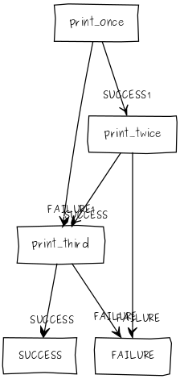

# vizualizer

##Example Output##


##How to use (instructions for ubuntu)
preferable to use virtual env [virtualenv tutorial](http://docs.python-guide.org/en/latest/dev/virtualenvs/)
- clone the repo
- ```sudo apt-get install graphviz librsvg2-bin plotutils```
- ```sudo pip install -r requirements.txt ```
- ```python viz.py content/other-flow.sl >> other.png```
